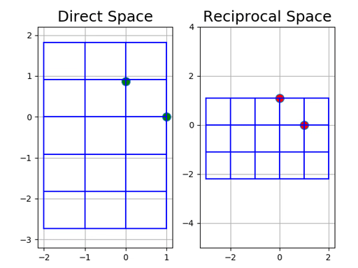

## Reciprocal Lattice Animation

The *reciprocal lattice* of a given lattice is the Fourier transform this given lattice 
This project is a live visualization tool developed in **Python** that helps the user understanding the way the:
<ul>
  <li> Direct Lattice (also real space) </li>
  <li> Reciprocal Lattice (also Fourir space) </li>
</ul>
are related together.

### Reciprocal Lattice
Definition:
Given a set  

 
of basis vectors,
the *Bravais Lattice* is the set of all integer linear combinaisons of the form
 

 
The *reciprocal lattice* of this lattice is the set of all vectors  that verifies  

 
The *reciprocal basis*  

 
is given by the NxN conditions  

### Example

By a simple **click and drag** action, the user can vary either the two basis vectors of the Direct or Reciprocal lattice.

